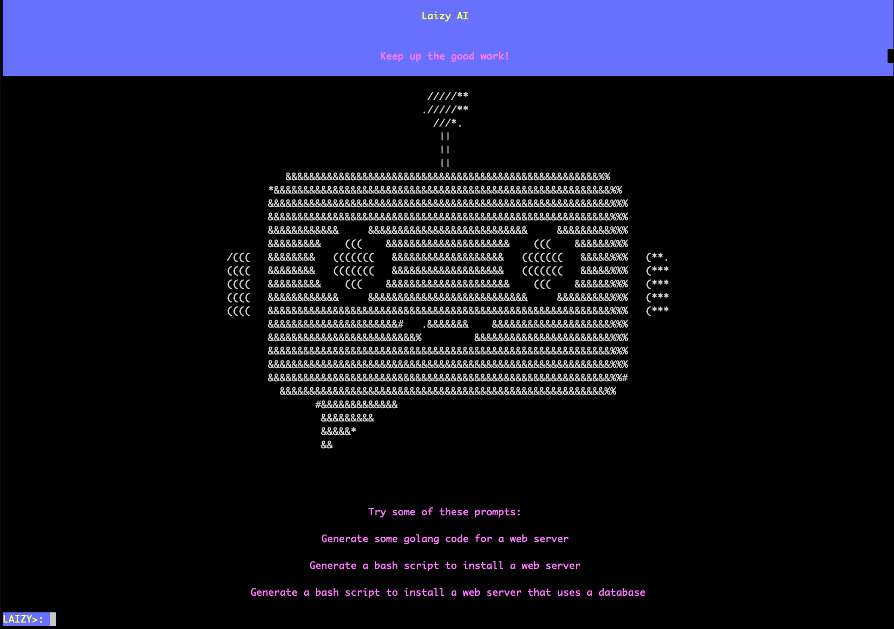

# Laizy Shell

An interactive shell environment with an enhanced AI assistant. All the power of laizy.dev in a handy commandline tool.

<!-- image of laizy-shell -->


## Features

- **Natural language understanding:** laizy understands you and can answer your questions
- **Versatile input:** laizy is a general purpose assistant, it can answer questions about anything (engineering, science, history, etc.)
- **Easy installation:** just download laizy and you're good to go
- **Made with love:** laizy is designed to be easy to use, and make the power of AI accessible to everyone


# Installation
Laizy is written in Go, so you'll need to have Go installed on your machine. You can download Go [here](https://golang.org/dl/). After that you can install laizy by running the following command:

```bash
go install github.com/laizy-ai/laizy-shell@latest
```

Alternatively, you can download the latest release from the [releases page](https://github.com/laizy-ai/laizy-shell/releases).


# Usage

The Laizy CLI provides a number of commands to help you be more productive. You can type a prompt directly in directly, load a file, or use the multi-line interactive mode.

Head over to https://app.laizy.dev to sign-up and get an API key.   

You'll need to set the LAIZY_API_KEY environment variable to your API key. You can do this by running the following command:

```
export LAIZY_API_KEY=YOUR_API_KEY
```

Next, you can run the following command to start the Laizy Shell:
` laizy-shell `

```
help - Show help
clear - Clear the screen
exit - Exit the shell

%multi - Toggle multi-line mode
%load - Load a prompt from file, e.g. %load prompt.txt
%save - Save prompt output to a file, e.g. %save output.txt
%exec - Execute a shell command
%history - Show prompt history
```

